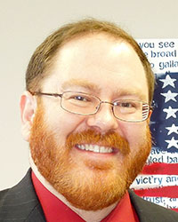

---
# You don't need to edit this file, it's empty on purpose.
# Edit theme's home layout instead if you wanna make some changes
# See: https://jekyllrb.com/docs/themes/#overriding-theme-defaults
layout: home
---

{: style="float: right;
       padding-left: 5px;
       padding-right: 0px;
       text-align: center;
       width: 350px;
       box-sizing: border-box;
       "}

## Ted Corcovilos, Ph.D.

Experimental atomic physics research at [Duquesne University](http://www.duq.edu) and [Pittsburgh Quantum Institute](http://www.pqi.org).

[Research](./research/) interests include ultracold atoms, related optics, chemical spectroscopy, environmental hazards.

[Teaching](./teaching/) interests include undergraduate physics, especially upper division courses.

[More info](./about/) about where to find me online. 