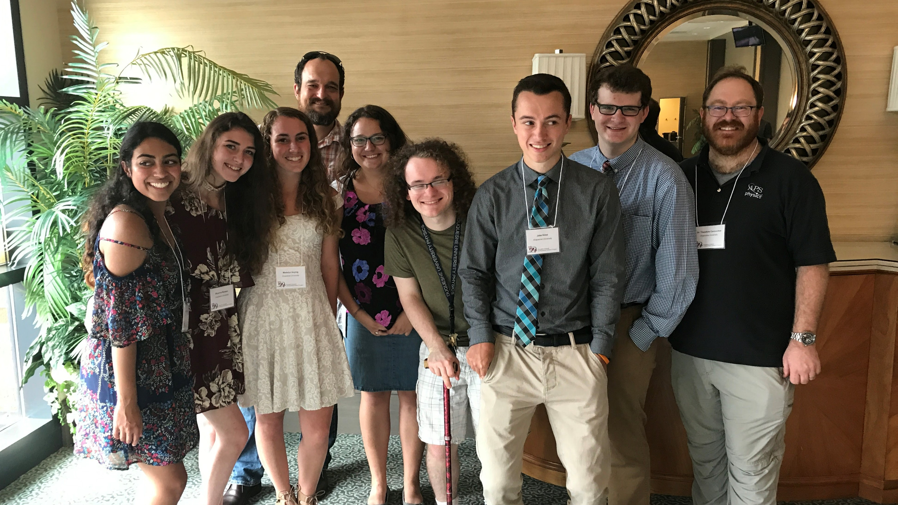



 
Corcovilos Lab members and alumni at the 2017 Undergraduate Research Symposium.
{: style="text-align: center; color: #606060; padding: 5px;
font-size: 0.9em; font-style: italic;"}

## Current members

### Faculty


* **{{ person.name }}** ({{ person.start }}--), {{ person.degree }} {{ person.grad }}



### Undergraduate Students


* **{{ person.name }}** ({{ person.start }}--), {{ person.degree }}, Graduating in {{ person.grad }}



<!--
### High School Students


* **{{ person.name }}** ({{ person.start }}--{{person.end}})


-->

## Former members
### Undergraduate Students


* **{{ person.name }}** ({{ person.start }}--{{person.end}}), {{ person.degree }}, {{ person. grad }}.  Now: {{ person.now }}.



### High School Students


* **{{ person.name }}** ({{ person.start }}--{{person.end}}), {{ person.degree }}, {{ person. grad }}.  Now: {{ person.now }}.



## Current Collaborators


* **{{ person.name }}**  {{ person.now }}.


