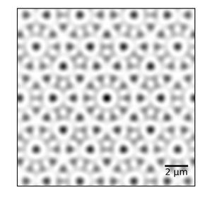
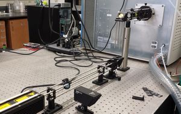
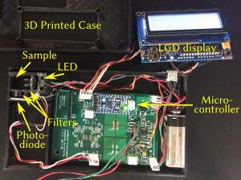
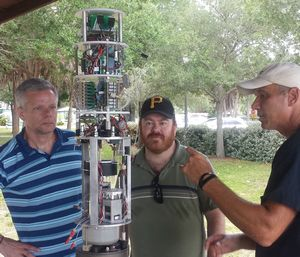

{:flt: style="float: right;
       padding-left: 5px;
       padding-right: 0px;
       text-align: center;
       width: 350px;
       box-sizing: border-box;
       "}



Broadly speaking, atomic physics, but also applications of spectroscopy to molecular systems.  All of my research is done with the help of undergraduate students.  If you're interested in working on any of these projects, please [contact me](mailto:corcovilost@duq.edu).  *No previous experience is required, just curiosity and a willingness to work hard.*

## Ultracold atoms in quasicrystal potentials
 
Simulated quasicrystal optical potential  
 
LTQ mass spectrometer with custom viewport for IRMPD and other optical experiments.
{:flt}

My main research project is studying atoms in two-dimensional optical potentials generated by interfering laser beams.  The overall goal is to study the low-energy states of topologically interesting phases, such as quasicrystals (see right).

## Laser spectroscopy for chemistry applications
### Infrared Multi-Photon Dissociation of gas-phase ions
Infrared Multi-Photon Dissociation uses high flux mid-IR lasers to heat molecules to their breaking point.
We measure the fragmentation products using mass spectrometry to infer structural information and gas-phase reaction pathways.
I do this work in collaboration with Michael Van Stipdonk in the Chemistry and Biochemistry Department at Duquesne,
both in Mike's lab, where I've installed a 20-W CO2 laser onto his linear ion trap (Thermo-Fisher LTQ),
and at free electron user facilities such as the Free Electron Laser for Infrared eXperiments ([FELIX](http://www.ru.nl/felix/)) at Radboud University in Nijmegen, the Netherlands and Le Centre Laser Infrarouge d'Orsay ([CLIO](http://old.clio.lcp.u-psud.fr/clio_eng/clio_eng.htm)) at Université Paris-Sud in Orsay, France.
Presently we are interested in high-valence actinide chemistry, in collaboration with John Gibson from Lawrence Berkeley National Laboratory (Berkeley, CA).

### Fluorescent detection of lead in water
 
Homemade fluorometer for measuring lead in drinking water
{:flt}

In collaboration with Partha Basu at IUPUI, we've build a small handheld spectrometer that uses a specific turn-on fluorophor for detecting lead in drinking water.  The latest version of the device is sensitive down to about 2 ppb concentrations (by mass), below the EPA action limit of 15 ppb.  Our hope is to make several copies of the device and test homes in the neighborhoods of Pittsburgh near Duquesne.

### Laser-Induced Fluorescence for Quantitation of Cross-Linking in Bio-polymers
This work uses fluorescent tags that bind to cross-links in bio-organic polymers.  Michael Cascio (Duquesne Chemistry and Biochemistry) and I are building a system to put a microfluidics fluorescence cell in tandom with a mass spectrometer to allow quantitative measurements of cross-linking reaction efficiencies.

### Automated sampling system for river and lake water
 
Automated water sampling system build by David Friese (right) that will be fitted with components from Duquesne including a gamma ray spectrometer.
{:flt}

My group with Dr. Michael Van Stipdonk (Duquesne Chemistry) and David Fries (University of South Florida - St. Petersburg) are working on an automated sampling system to collect water samples in rivers and lakes.  The system collects samples for later mass spectrometry analysis and does realtime detection of radionuclides using a homemade gamma spectrometer.